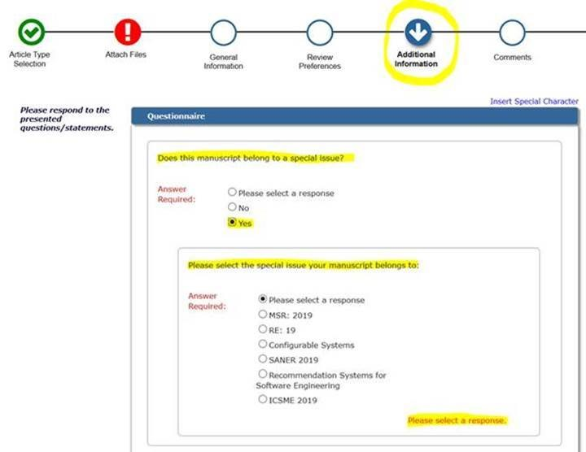

_This page is for accepted special issues._

_We recommend at least 3-4 months between intent to submit and actual submission._

# Email Template for Invited Papers

Please use the following template to invite papers to the special issue/

**Subject: CONFERENCE YEAR: EMSE Special Issue Invitation**
 
Dear AUTHOR NAMES,

We are happy to invite you to extend your CONFERENCE paper titled,

PAPER TITLE

for the Special Issue of CONFERENCE in the Empirical Software Engineering (EMSE) journal (<https://link.springer.com/journal/10664>). We had a great set of accepted papers to select from this year but and your paper selected to be among the ones to be given the chance to extend for journal publication.

Please note that this invitation does NOT guarantee that your paper will be accepted; it gets a special "track" into the journal but will be peer reviewed as any other paper submitted to EMSE.

To be accepted your extended paper should fulfil requirements on what constitutes an extension from a conference publication to a journal one; as a starting point these rules can be based on the STVR ones in: <https://cs.gmu.edu/~offutt/stvr/26-7-October2016.html> and in: <http://cs.gmu.edu/~offutt/stvr/26-4-june2016.html>.

Be sure to also read the general information about EMSE and, in particular, the instructions for authors that you can find linked from the page: <http://www.springer.com/computer/swe/journal/10664/PSE>

It will also be very important that you follow our deadlines as outlined below:

* intention to extend: December 15, 2019
* submission deadline: April 1, 2020

We have not fixed dates for additional rounds of revisions that might be needed since our top priority is to get high-quality papers. We will give feedback on your paper as soon as reviews are in.

Note that we need you to acknowledge if you are willing to accept this invitation. Please send an email to us (guest editors of the SI) no later than December 15th 2019. We will then get back to you with further details about the submission process in the EMSE system. 

Thanks and we hope you will take the chance to extend your paper!

Best regards, 
NAMES OF THE PC CHAIRS 
CONFERENCE YEAR Program Co-Chairs.
 
 
HOW TO SUBMIT
 
To submit to the special issue, please use EMSE submission site <https://www.editorialmanager.com/emse/default.aspx>

Please (1) select "Research Papers" and (2) later on the Additional Information page.
 
*	Answer "Yes" to "Does this paper belong to a special issue?"
*	And select "CONFERENCE YEAR" for "Please select the issue your manuscript belongs to."

